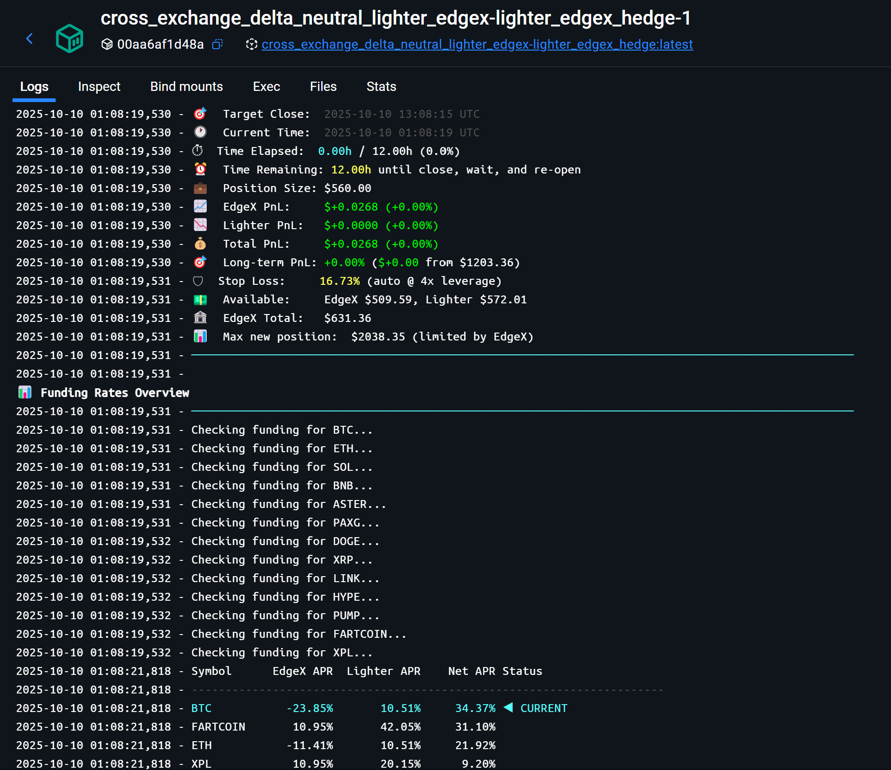

# Cross-Exchange Delta Neutral Hedging System

**Automated 24/7 funding rate arbitrage bot** for EdgeX and Lighter cryptocurrency perpetual futures exchanges. Continuously monitors multiple markets, selects the best opportunities, and rotates delta-neutral positions to maximize profits while maintaining market-neutral exposure.

## 🎯 Overview

This is an **automated trading system** that runs 24/7 to capture funding rate arbitrage. The bot:
- 📊 **Analyzes** funding rates across may cryptocurrency markets (user can specify a list)
- 🎯 **Selects** the best opportunity (highest net APR)
- 🔄 **Opens** simultaneous LONG and SHORT positions (delta-neutral)
- ⏱️ **Holds** for 8 hours collecting funding payments
- 💰 **Closes** and rotates to the next best opportunity
- 🔁 **Repeats** indefinitely

Referral link to support this work: https://pro.edgex.exchange/referral/FREQTRADE

### 🤖 Automated Rotation Bot (Primary Feature)

The **auto_rotation_bot** is the core of this system - a fully automated trading bot that requires no manual intervention:

- ✅ **Fully Automated** - Set it and forget it, runs 24/7
- ✅ **Intelligent Market Selection** - Always picks the best funding opportunity
- ✅ **Position Rotation** - Automatically closes and reopens every 8 hours (configurable)
- ✅ **Stop-Loss Protection** - Auto-closes if any leg exceeds risk threshold
- ✅ **Crash Recovery** - Survives restarts, detects and reconciles positions
- ✅ **Persistent State** - Full cycle history and cumulative PnL tracking
- ✅ **Real-time Monitoring** - Console dashboard with position health and funding rates

See [AUTO_ROTATION_BOT_README.md](AUTO_ROTATION_BOT_README.md) for detailed documentation.

### 🛠️ Manual Trading CLI (Supporting Tool)

The **hedge_cli** provides manual control when you need it:

- ✅ **Analysis Tools** - Check funding rates, capacity, leverage across markets
- ✅ **Manual Position Management** - Open/close specific positions on demand
- ✅ **Testing Functions** - Test leverage setup and position cycles safely
- ✅ **Position Monitoring** - Check current position status and health
- ✅ **Direct Exchange Control** - For advanced users who want full control

## 📋 Prerequisites

- Python 3.8+
- Active accounts on EdgeX and Lighter exchanges
- API credentials for both exchanges
- Sufficient capital on both exchanges

## 🚀 Quick Start (Automated Bot)

### 1. Installation

```bash
cd /path/to/CROSS_EXCHANGE_DELTA_NEUTRAL

# Install dependencies
pip install -r requirements.txt
```

### 2. Configure API Credentials

Copy the example environment file and fill in your credentials:

```bash
cp .env.example .env
# Edit .env with your actual credentials
```

The `.env` file should contain:

```bash
# EdgeX
EDGEX_BASE_URL=https://pro.edgex.exchange
EDGEX_WS_URL=wss://quote.edgex.exchange
EDGEX_ACCOUNT_ID=your_account_id
EDGEX_STARK_PRIVATE_KEY=your_stark_private_key

# Lighter
API_KEY_PRIVATE_KEY=your_lighter_private_key
ACCOUNT_INDEX=0
API_KEY_INDEX=0
```

**Note:** A `.env.example` file is provided as a template with placeholder values. Margin mode is hardcoded to "cross" for delta-neutral hedging.

### 3. Configure the Rotation Bot

Edit `rotation_bot_config.json` to customize the bot's behavior:

```json
{
  "symbols_to_monitor": ["BTC", "ETH", "SOL", "PAXG", "HYPE", "XPL"],
  "quote": "USD",
  "leverage": 3,
  "notional_per_position": 320.0,
  "hold_duration_hours": 8.0,
  "wait_between_cycles_minutes": 5.0,
  "check_interval_seconds": 300,
  "min_net_apr_threshold": 5.0,
  "stop_loss_percent": 25.0,
  "enable_stop_loss": true
}
```

**Key settings:**
- `symbols_to_monitor`: Markets to analyze (more symbols = better opportunities)
- `notional_per_position`: Maximum position size (bot adjusts to available capital)
- `leverage`: Leverage on both exchanges (3-5x recommended)
- `stop_loss_percent`: Safety threshold (25% for 3x leverage)

See [Configuration Details](#-configuration-details) below for all parameters.

### 4. Run the Bot

```bash
# Start the bot (runs continuously)
python auto_rotation_bot.py

# Or with Docker (recommended for 24/7 operation)
docker-compose up -d auto_rotation_bot

# View live logs
docker-compose logs -f auto_rotation_bot
```

The bot will:
1. ✅ Load state from previous session (if exists)
2. ✅ Verify any existing positions
3. ✅ Start analyzing funding rates
4. ✅ Open the best position and begin rotation cycle

**That's it!** The bot now runs on autopilot.

### 5. Monitor the Bot



The bot displays:
- Current cycle number and position details
- Real-time PnL (EdgeX, Lighter, Total)
- Available capital and max position size
- Top 5 funding opportunities (highlights current position)
- Time elapsed/remaining until position close

See [AUTO_ROTATION_BOT_README.md](AUTO_ROTATION_BOT_README.md) for complete documentation.

### 6. (Optional) Test Manually First

Before running the bot, you can test manually with small positions:

```bash
# Create hedge_config.json for manual testing
# See example in Configuration Details section below

# Test leverage setup (no trading)
python hedge_cli.py test_leverage

# Test with $20 position
python hedge_cli.py test --notional 20
```

---

## 🛠️ Manual Trading CLI (hedge_cli.py)

For manual control or analysis, use `hedge_cli.py`. Useful for testing or when you need direct control over positions.

**Key Commands:**

| Command | Description |
|---------|-------------|
| `python hedge_cli.py funding_all` | Compare funding rates across all markets |
| `python hedge_cli.py funding` | Check funding rates for configured symbol |
| `python hedge_cli.py capacity` | Calculate max position size from available capital |
| `python hedge_cli.py status` | Check current position status on both exchanges |
| `python hedge_cli.py open --size-quote 100` | Open $100 delta-neutral position |
| `python hedge_cli.py close` | Close both positions |
| `python hedge_cli.py test --notional 20` | Test with $20 position (auto-closes) |

**Manual Trading Config (hedge_config.json):**
```json
{
  "symbol": "PAXG",
  "quote": "USD",
  "long_exchange": "lighter",
  "short_exchange": "edgex",
  "leverage": 3,
  "notional": 40
}
```

<details>
<summary><b>📖 View All Manual Commands</b></summary>

### Analysis Commands

```bash
# Check funding rates
python hedge_cli.py funding

# Compare multiple markets
python hedge_cli.py funding_all --symbols BTC ETH SOL

# Check leverage limits
python hedge_cli.py check_leverage

# Check available capital
python hedge_cli.py capacity

# Check position status
python hedge_cli.py status
```

### Trading Commands

```bash
# Open position (uses notional from config)
python hedge_cli.py open

# Open with specific size
python hedge_cli.py open --size-quote 100
python hedge_cli.py open --size-base 0.05

# Close positions
python hedge_cli.py close
```

### Testing Commands

```bash
# Test leverage setup
python hedge_cli.py test_leverage

# Test open+close cycle
python hedge_cli.py test --notional 20

# Test with auto-close
python hedge_cli.py test_auto --notional 20
```

**Note:** Use `--config path/to/config.json` before the command to use a different config file.

</details>

---

## 🔧 Configuration Details

<details>
<summary><b>📄 hedge_config.json (for manual trading)</b></summary>

| Field | Type | Description |
|-------|------|-------------|
| `symbol` | string | Base asset (e.g., "PAXG", "BTC", "ETH") |
| `quote` | string | Quote currency (default: "USD") |
| `long_exchange` | string | Exchange for long position ("edgex" or "lighter") |
| `short_exchange` | string | Exchange for short position ("edgex" or "lighter") |
| `leverage` | number | Leverage to use on both exchanges |
| `notional` | number | Default notional size in quote currency for `open` command (default: 40.0) |

**Note:** The `funding` command will automatically update `long_exchange` and `short_exchange` to optimal values based on current funding rates.

</details>

### rotation_bot_config.json

Configuration file for the automated rotation bot (`auto_rotation_bot.py`). This bot continuously monitors multiple markets and rotates positions to capture the best funding rate opportunities.

| Field | Type | Default | Description |
|-------|------|---------|-------------|
| `symbols_to_monitor` | array | `["BTC", "ETH", ...]` | List of symbols to analyze for funding opportunities |
| `quote` | string | `"USD"` | Quote currency for all markets |
| `leverage` | number | `3` | Leverage to use on both exchanges for all positions |
| `notional_per_position` | number | `320.0` | Maximum position size in USD (bot adjusts to actual available capital) |
| `hold_duration_hours` | number | `8.0` | How long to hold each position before closing (hours) |
| `wait_between_cycles_minutes` | number | `5.0` | Cooldown period between closing one position and opening the next (minutes) |
| `check_interval_seconds` | number | `300` | How often to check position health while holding (seconds, default: 5 minutes) |
| `min_net_apr_threshold` | number | `5.0` | Minimum net APR required to open a position (%) |
| `stop_loss_percent` | number | `25.0` | Stop-loss threshold as % of position notional (triggers on either leg) |
| `enable_stop_loss` | boolean | `true` | Enable automatic stop-loss protection |
| `max_position_count` | number | `1` | Maximum number of concurrent positions (currently only supports 1) |
| `enable_pnl_tracking` | boolean | `true` | Enable comprehensive PnL tracking |
| `enable_health_monitoring` | boolean | `true` | Enable position health monitoring during hold period |

**Example configuration:**
```json
{
  "symbols_to_monitor": ["BTC", "ETH", "SOL", "PAXG", "HYPE", "XPL"],
  "quote": "USD",
  "leverage": 3,
  "notional_per_position": 320.0,
  "hold_duration_hours": 8.0,
  "wait_between_cycles_minutes": 5.0,
  "check_interval_seconds": 300,
  "min_net_apr_threshold": 5.0,
  "stop_loss_percent": 25.0,
  "enable_stop_loss": true
}
```

**Key Configuration Tips:**
- **symbols_to_monitor**: Include 5-15 symbols for best opportunity selection. The bot will choose the symbol with highest net APR each cycle.
- **notional_per_position**: Set to maximum desired position size. Bot automatically adjusts down based on available capital on both exchanges.
- **check_interval_seconds**: 300s (5 minutes) balances monitoring frequency with API rate limits.
- **stop_loss_percent**: Should be significantly higher than your leverage to avoid false triggers. For 3x leverage, 25% is recommended. For 5x leverage, use 10-15%.
- **hold_duration_hours**: 8 hours captures 2 EdgeX funding periods (every 4h) and 8 Lighter funding periods (every 1h).

**State Persistence:**
- Bot state is saved to `logs/bot_state.json`
- Includes cycle counter, current position details, completed cycles history, and cumulative statistics
- Survives crashes and restarts with automatic position reconciliation

See [AUTO_ROTATION_BOT_README.md](AUTO_ROTATION_BOT_README.md) for complete documentation.

<details>
<summary><b>🔑 Environment Variables (.env file)</b></summary>

**EdgeX:**
- `EDGEX_BASE_URL` - API base URL (default: https://pro.edgex.exchange)
- `EDGEX_WS_URL` - WebSocket URL (default: wss://quote.edgex.exchange)
- `EDGEX_ACCOUNT_ID` - Your EdgeX account ID
- `EDGEX_STARK_PRIVATE_KEY` - Your StarkNet private key

**Lighter:**
- `LIGHTER_BASE_URL` or `BASE_URL` - API base URL
- `LIGHTER_WS_URL` or `WEBSOCKET_URL` - WebSocket URL
- `API_KEY_PRIVATE_KEY` or `LIGHTER_PRIVATE_KEY` - Your Lighter private key
- `ACCOUNT_INDEX` or `LIGHTER_ACCOUNT_INDEX` - Account index (default: 0)
- `API_KEY_INDEX` or `LIGHTER_API_KEY_INDEX` - API key index (default: 0)

**Note:** Margin mode is hardcoded to "cross" for delta-neutral hedging and cannot be changed.

</details>

<details>
<summary><b>🎓 How It Works (Technical Details)</b></summary>

### Funding Rate Arbitrage

Perpetual futures exchanges charge/pay funding rates periodically:
- **EdgeX**: Every 4 hours (6 times per day)
- **Lighter**: Every hour (24 times per day)

When funding rates differ between exchanges, you can:
1. **SHORT** the exchange with higher positive funding (collect funding)
2. **LONG** the exchange with lower/negative funding (pay less or collect)
3. Remain **delta-neutral** (no exposure to price movement)

### Position Sizing

The system ensures both exchanges receive **identical position sizes** despite different tick sizes:

1. Identifies the coarser tick size (larger of the two)
2. Floors the requested size to this tick
3. Verifies both exchanges round to the same value
4. Displays tick sizes and final position size for transparency

### Leverage Management

Before opening positions, the system:
1. Sets leverage on both exchanges to match config
2. Verifies EdgeX leverage setting (when possible)
3. Warns if configuration fails but allows proceeding

### Order Execution

Uses **aggressive limit orders** that cross the spread:
- **Buy orders**: `best_ask + (cross_ticks × tick_size)`
- **Sell orders**: `best_bid - (cross_ticks × tick_size)`
- **Default cross_ticks**: 10 (for fast execution)

This ensures immediate fills while maintaining control over pricing (unlike market orders).

Both positions are placed **concurrently** using `asyncio.gather()` to minimize timing risk.

</details>

## 📊 Example Workflows

### Automated Trading (Recommended)

```bash
# 1. Configure the bot
nano rotation_bot_config.json  # Edit symbols, leverage, position size

# 2. Start the bot
docker-compose up -d auto_rotation_bot

# 3. Monitor progress
docker-compose logs -f auto_rotation_bot

# That's it! The bot handles everything automatically.
```

### Manual Trading

```bash
# 1. Analyze funding rates across markets
python hedge_cli.py funding_all

# 2. Check specific market and auto-optimize config
python hedge_cli.py funding

# 3. Check available capacity
python hedge_cli.py capacity

# 4. Test leverage setup
python hedge_cli.py test_leverage

# 5. Run small test trade
python hedge_cli.py test --notional 20

# 6. Open real position
python hedge_cli.py open --size-quote 500

# 7. Check position status
python hedge_cli.py status

# 8. Close when desired
python hedge_cli.py close
```

**Note:** Manual commands use `hedge_config.json` by default. Use `--config path/to/config.json` before the command name if using a different config file.

## ⚠️ Risk Management

**Important:**
- ⚠️ Start with small positions ($50-100) to test the system
- ⚠️ Monitor the bot regularly, especially first few cycles
- ⚠️ Funding rates can change rapidly - past performance ≠ future results
- ⚠️ Leverage amplifies both gains and losses
- ⚠️ Network issues may cause one leg to fail (bot detects this)
- ⚠️ Keep >20% margin buffer to avoid liquidation

**Safety Features:**
- ✅ Stop-loss protection (auto-closes if leg exceeds threshold)
- ✅ Position verification after opening/closing
- ✅ Crash recovery with state reconciliation
- ✅ Identical position sizes on both exchanges (prevents unhedged exposure)

<details>
<summary><b>🛡️ Liquidation Monitor (Optional Safety Tool)</b></summary>

Continuous monitoring service to protect delta-neutral positions from liquidation risk:

```bash
# Run with defaults (60s interval, 20% margin threshold)
python liquidation_monitor.py

# Custom parameters
python liquidation_monitor.py --interval 30 --margin-threshold 15.0

# Docker service (runs continuously with auto-restart)
docker-compose up liquidation_monitor
```

**Key features:**
- ✅ Monitors positions on both exchanges every N seconds
- ✅ Checks margin ratio and unrealized PnL
- ✅ Auto-closes positions if margin exceeds threshold
- ✅ Colored console output (green/yellow/red based on health)
- ✅ Detailed logging to `logs/liquidation_monitor.log`
- ✅ Detects unhedged positions (when one leg fails)

**Auto-close triggers:**
- Margin ratio exceeds threshold (default: 80%)
- Position becomes unhedged (only one side has position)
- Critical errors fetching position data

</details>

## 🐳 Docker Support

This project includes Docker support for running the automated rotation bot 24/7.

### Active Services

**Automated Rotation Bot** (pre-configured and ready to use):
```bash
# Start in background with auto-restart
docker-compose up -d auto_rotation_bot

# View logs (live)
docker-compose logs -f auto_rotation_bot

# Stop the bot
docker-compose stop auto_rotation_bot
```

### Optional Services

The `docker-compose.yml` file includes commented-out configurations for manual trading commands. To use them, uncomment the desired service and run:

**Analysis Commands** (after uncommenting in docker-compose.yml):
```bash
docker-compose run capacity              # Check available capital
docker-compose run funding               # Check funding rates
docker-compose run funding_all           # Compare multiple markets
docker-compose run status                # Check position status
docker-compose run check_leverage        # Check leverage info
```

**Trading Commands** (after uncommenting in docker-compose.yml):
```bash
docker-compose run open                  # Open position
docker-compose run open --size-quote 100 # Open with custom size
docker-compose run close                 # Close position
```

**Testing Commands** (after uncommenting in docker-compose.yml):
```bash
docker-compose run test_leverage         # Test leverage setup
docker-compose run test --notional 20    # Test open+close cycle
docker-compose run test_auto             # Automated test
```

**Monitoring Services** (after uncommenting in docker-compose.yml):
```bash
docker-compose up -d liquidation_monitor # Run in background
docker-compose logs -f liquidation_monitor # View logs
docker-compose stop liquidation_monitor  # Stop monitor
```

### Building the Image

To build the Docker image:
```bash
docker-compose build
```


## 📝 Logging

**hedge_cli.py:**
- Logs to `hedge_cli.log` (DEBUG level and above)
- Console shows WARNING level and above only
- Review logs for detailed execution information

**liquidation_monitor.py:**
- Logs to `logs/liquidation_monitor.log` (DEBUG level and above)
- Console shows INFO level and above with colored output
- Detailed position health tracking and auto-close events

<details>
<summary><b>🔍 Troubleshooting</b></summary>

### Bot enters ERROR state
- Check `logs/auto_rotation_bot.log` for details
- Verify positions on both exchanges manually
- Delete `logs/bot_state.json` and restart if needed

### "Computed size rounds to zero"
- Increase position size in config
- Check available capital with `capacity` command

### "Leverage setting failed"
- Verify API credentials in `.env`
- Check exchange-specific leverage limits with `check_leverage`
- Ensure you have KYC/permissions on both exchanges

### "One or more orders failed"
- Check both exchanges manually for partial fills
- Review `hedge_cli.log` for detailed error messages
- Verify sufficient available balance on both exchanges

### Bot keeps waiting, no positions opened
- Lower `min_net_apr_threshold` in config (try 3-5%)
- Add more symbols to `symbols_to_monitor`
- Wait for better funding rate conditions

</details>

## 📚 Documentation

- [AUTO_ROTATION_BOT_README.md](AUTO_ROTATION_BOT_README.md) - Detailed bot documentation
- [CLAUDE.md](CLAUDE.md) - Technical architecture for developers
- [EdgeX API Docs](https://docs.edgex.exchange/) - EdgeX exchange documentation
- [Lighter Protocol Docs](https://docs.lighter.xyz/) - Lighter exchange documentation

## 📧 Support

**Logs:**
- Bot: `logs/auto_rotation_bot.log`
- Manual CLI: `hedge_cli.log`
- Liquidation Monitor: `logs/liquidation_monitor.log`

**Issues:** Check logs first, then consult documentation above.


